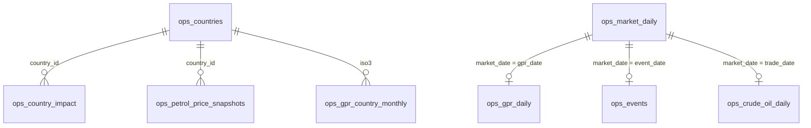
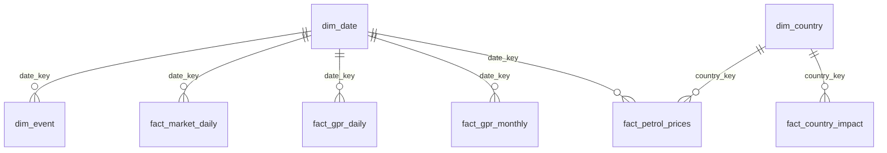

# Semantic News and Oil Price Database Project

This project turns a collection of oil-market, geopolitical risk, semantic
news, and country exposure CSV files into a reproducible analytics workflow.
It supports two complementary paths: a MySQL-backed database layer with
operational tables, dimensional tables, and reusable SQL views, and a
time-series modeling layer that trains a transparent `StandardScaler -> Ridge`
pipeline to predict next-trading-day Brent crude prices and produces a 10-day
Monte Carlo forecast.

Project repository: [github.com/DiscM/DatabaseProject](https://github.com/DiscM/DatabaseProject)

For the shortest setup path, start with [QUICKSTART.md](QUICKSTART.md).

The data combines:

- Geopolitical risk and semantic news signals (`ops_gpr_daily`, `ops_gpr_monthly`, `ops_events`)
- Oil and market prices (`ops_market_daily`, `ops_crude_oil_daily`)
- Country-level petrol exposure and impacts (`ops_countries`, `ops_country_impact`, `ops_petrol_price_snapshots`)
- Warehouse-ready dimensions and facts (`dim_*`, `fact_*`)

## Database Schema

The project keeps two complementary database layers: operational source-style tables for modeling and exploration, plus dimensional tables for BI-style reporting. Full column-level ERDs are available in [docs/database_schema.md](docs/database_schema.md).

### Operational ERD

The operational layer preserves the source-style CSV tables used for exploration, joins, and model feature engineering.



### Dimensional Reporting ERD

The dimensional layer organizes dates, countries, events, market facts, GPR facts, and petrol impact facts for BI-style reporting.



### Analysis Views

After loading the CSV tables, `src/load_mysql.py` applies `sql/analytics_views.sql` to create analysis-ready joins:

- `vw_daily_oil_news_features`: daily Brent/WTI, GPR, event, and volatility features for modeling.
- `vw_event_price_reaction`: event dates paired with same-day oil price and risk indicators.
- `vw_country_petrol_impact`: country exposure, petrol price snapshots, and vulnerability indicators.

## Project Layout

```text
main.py                    One-command pipeline runner (no MySQL required)
main_with_db.py            One-command pipeline runner WITH MySQL integration
src/
  db_config.py             MySQL connection config (reads .env)
  features.py              Shared feature constants & helpers
  load_mysql.py            CSV-to-MySQL loader with inferred table schemas
  pipeline.py              Shared pipeline orchestration
  train_oil_model.py       Ridge training (10 horizons, h=1..10)
  predict_oil_price.py     Monte Carlo stochastic 10-day forecast
Visualization/
  visualize_predictions.py Interactive Plotly charts (scatter + forecast fan)
compile_notebook.py        Regenerates oil_news_project_demo.ipynb from sources
tests/                     Pytest test suite (52 tests)
ruff.toml                  Ruff linter configuration
pyrightconfig.json         Pyright type checker configuration
.github/workflows/ci.yml   GitHub Actions CI workflow
datasets/                  Source CSV files
docs/database_schema.md    Full column-level operational and dimensional ERDs
sql/analytics_views.sql    MySQL views for analysis-ready joins
model_artifacts/           Trained models, test predictions, forecast CSV
reports/                   Markdown project report
output/pdf/                Exported PDF report
scripts/export_html_presentation_pdf.ps1
                           HTML presentation to PDF export pipeline
docker-compose.yml         Local MySQL 8.4 service
```

## Quick Run (No MySQL)

Run the full train -> predict -> visualize pipeline from a single command:

```powershell
python main.py
```

This trains the model, generates a Monte Carlo forecast, and opens two
interactive Plotly charts in the browser. MySQL is **not** required.

## Quick Run (With MySQL)

Start the Docker container, then run the full pipeline including CSV import:

```powershell
docker compose up -d
python main_with_db.py
```

`main_with_db.py` automatically waits for MySQL to finish initialising before proceeding - no manual sleep or retry is needed.

## Manual Step-by-Step

### 1. Install Dependencies

```powershell
python -m pip install -r requirements.txt
```

### 2. Start MySQL (optional - skip if not using the database)

```powershell
docker compose up -d
```

### 3. Load Datasets into MySQL

```powershell
python src\load_mysql.py --replace
```

The loader creates the database, one table per CSV, infers column types from
`datasets/data_dictionary.csv`, and applies `sql/analytics_views.sql`.

Example query after loading:

```sql
SELECT market_date, brent_price_usd, gpr_index, event_type, event_severity
FROM vw_daily_oil_news_features
WHERE event_flag = 1
ORDER BY market_date DESC
LIMIT 20;
```

### 4. Train the Model

```powershell
python src\train_oil_model.py
```

Trains one `StandardScaler -> Ridge` model per horizon (h=1 through h=10).
Each model predicts directly N days ahead from today's real data with a direct
multi-step strategy, so there is no iterative error accumulation.

Artifacts saved to `model_artifacts/`:

- `oil_price_model.joblib` (h=1, primary)
- `oil_price_model_h{N}.joblib` for N = 2..10
- `oil_price_model.json` (metrics + per-horizon RMSE)
- `test_predictions.csv`

Current benchmark (h=1):

| Metric | Training | Test | Previous-price baseline |
|--------|----------|------|-------------------------|
| MAE    | 1.080 USD | 1.121 USD | 1.113 USD |
| RMSE   | 1.567 USD | 1.519 USD | 1.536 USD |
| MAPE   | 1.515% | 1.467% | 1.457% |
| R-squared | 0.996 | 0.967 | 0.966 |

### 5. Generate the Forecast

```powershell
python src\predict_oil_price.py
```

Runs 500 Monte Carlo simulation paths with Gaussian noise (sigma = h=1 RMSE)
injected at each step. A linear momentum blend over the last 10 trading days
corrects for the model's mean-reversion bias.

Output: `model_artifacts/forward_forecast.csv` - median + P10/P25/P75/P90
for each of the next 10 trading days.

CLI options:

```powershell
python src\predict_oil_price.py --n-sims 1000 --momentum-blend 0.5 --momentum-window 5
```
### 6. Visualize

```powershell
python Visualization\visualize_predictions.py
```

Opens two interactive Plotly charts in the browser:

1. **Prediction accuracy scatter** - actual vs predicted on the test set
2. **Model vs Baseline vs Actual** - time-series with the 10-day Monte Carlo
   probability fan (P10-P90 bands) bridged from the last real data point

### 7. Regenerate the Demo Notebook

```powershell
python compile_notebook.py
```

Rebuilds `oil_news_project_demo.ipynb` by reading the current source files
verbatim. Open and run it top-to-bottom in Jupyter for an end-to-end demo.

### 8. Export the HTML Presentation to PDF

```powershell
powershell -ExecutionPolicy Bypass -File scripts\export_html_presentation_pdf.ps1
```

The export script prints `output/presentations/oil_news_project_presentation.html`
with headless Chrome or Edge, writes
`output/presentations/oil_news_project_presentation_from_html.pdf`, verifies the
expected 9-page deck text, and removes its temporary browser profile.

## Code Quality

### Tests

```powershell
python -m pytest tests/ -v
```

52 tests covering feature construction, model training, forecast helpers, and
MySQL loader utilities. Run from the project root with `PYTHONPATH=src` on Linux/macOS.

### Linting

```powershell
pip install ruff
ruff check src/ main.py main_with_db.py compile_notebook.py
```

Formatting and import order can be auto-fixed with `ruff check --fix`.

### Type Checking

```powershell
pip install pyright
pyright
```

### Continuous Integration

Every push and pull request runs lint, type check, and tests via
`.github/workflows/ci.yml`.


