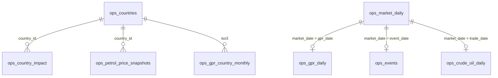
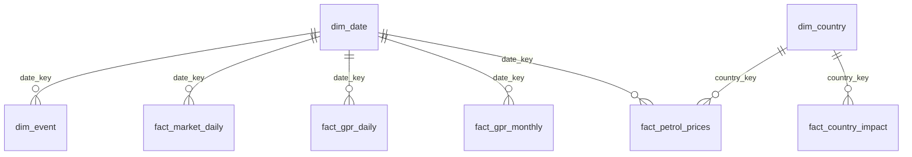

# Semantic News and Oil Price Database Project

This project compiles the workspace datasets into a MySQL database and trains a scikit-learn predictive model for next trading-day Brent crude oil prices.

For the shortest setup path, start with [QUICKSTART.md](QUICKSTART.md).

The data combines:

- Geopolitical risk and semantic news signals (`ops_gpr_daily`, `ops_gpr_monthly`, `ops_events`)
- Oil and market prices (`ops_market_daily`, `ops_crude_oil_daily`)
- Country-level petrol exposure and impacts (`ops_countries`, `ops_country_impact`, `ops_petrol_price_snapshots`)
- Warehouse-ready dimensions and facts (`dim_*`, `fact_*`)

## Database Schema

The project keeps two complementary database layers: operational source-style tables for modeling and exploration, plus dimensional tables for BI-style reporting. Full column-level ERDs are available in [docs/database_schema.md](docs/database_schema.md).

### Operational ERD

The operational layer preserves the source-style CSV tables used for exploration, joins, and model feature engineering.



### Dimensional Reporting ERD

The dimensional layer organizes dates, countries, events, market facts, GPR facts, and petrol impact facts for BI-style reporting.



### Analysis Views

After loading the CSV tables, `src/load_mysql.py` applies `sql/analytics_views.sql` to create analysis-ready joins:

- `vw_daily_oil_news_features`: daily Brent/WTI, GPR, event, and volatility features for modeling.
- `vw_event_price_reaction`: event dates paired with same-day oil price and risk indicators.
- `vw_country_petrol_impact`: country exposure, petrol price snapshots, and vulnerability indicators.

## Project Layout

```text
datasets/                  Source CSV files supplied in the workspace
docs/database_schema.md     Full column-level operational and dimensional ERDs
sql/analytics_views.sql    MySQL views for analysis-ready joins
src/load_mysql.py          CSV-to-MySQL loader with inferred table schemas
src/train_oil_model.py     scikit-learn Ridge regression training pipeline
src/predict_oil_price.py   Uses the saved model to predict from the latest row
model_artifacts/           Trained model JSON and test predictions
reports/                   Markdown project report
output/pdf/                Exported PDF report
docker-compose.yml         Optional local MySQL 8.4 service
```

## 1. Start MySQL

Option A: use the included Docker service.

```powershell
docker compose up -d
```

Option B: use an existing MySQL instance and create `.env` from the example.

```powershell
Copy-Item .env.example .env
```

Then edit `.env` with your MySQL credentials.

## 2. Install Dependencies

The project uses scikit-learn for modeling and `mysql-connector-python` for loading CSV files into MySQL.

```powershell
python -m pip install -r requirements.txt
```

## 3. Load the Datasets into MySQL

```powershell
python src\load_mysql.py --replace
```

The loader:

- Creates the configured database if needed
- Creates one MySQL table per CSV file
- Infers column types from `datasets/data_dictionary.csv`
- Loads all rows in batches
- Applies analysis views from `sql/analytics_views.sql`

Useful views:

- `vw_daily_oil_news_features`: daily joined oil, market, event, and GPR features
- `vw_event_price_reaction`: event dates with same-day oil market indicators
- `vw_country_petrol_impact`: country-level exposure, price snapshots, and impact labels

Example query:

```sql
SELECT market_date, brent_price_usd, gpr_index, event_type, event_severity
FROM vw_daily_oil_news_features
WHERE event_flag = 1
ORDER BY market_date DESC
LIMIT 20;
```

## 4. Train the Predictive Oil Model

```powershell
python src\train_oil_model.py
```

The model predicts next trading-day Brent price using current Brent/WTI prices, dollar index, volatility index, GPR/news features, lagged prices, volatility features, and event indicators from `ops_market_daily.csv`.

The training script fits this scikit-learn pipeline:

```text
StandardScaler -> Ridge Regression
```

Current run:

- Training rows: 3,236
- Test rows: 810
- Chronological split, no random shuffle
- Test RMSE: 1.516 USD
- Test MAE: 1.118 USD
- Previous-price baseline RMSE: 1.536 USD

Artifacts:

- `model_artifacts/oil_price_model.joblib`
- `model_artifacts/oil_price_model.json`
- `model_artifacts/test_predictions.csv`

## 5. Predict from the Latest Market Row

```powershell
python src\predict_oil_price.py
```

Latest bundled input row:

- Market date: 2026-03-12
- Current Brent: 95.76 USD
- Predicted next trading-day Brent: 95.90 USD