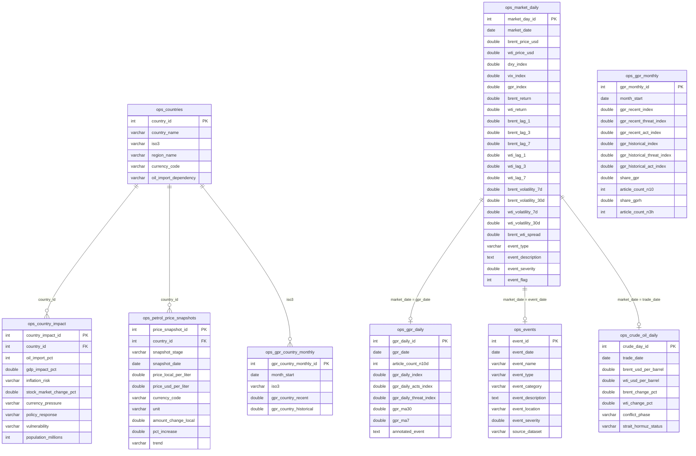
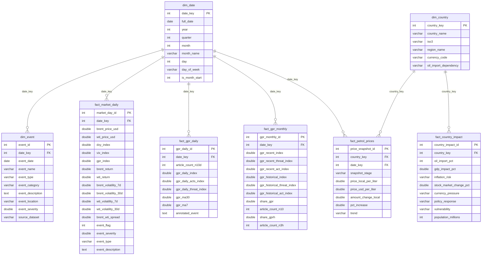

# Database Schema

The project keeps both the operational source-style tables and the dimensional/fact tables supplied in the workspace. The operational layer is best for modeling and exploratory analysis; the dimensional layer is useful for BI-style reporting.

## Core Operational ERD

## Dimensional Reporting ERD

## Analysis Views

The loader also applies these MySQL views from `sql/analytics_views.sql`:

- `vw_daily_oil_news_features`: modeling-ready daily Brent/WTI, GPR, event, and volatility features.
- `vw_event_price_reaction`: event-date oil price and risk indicators.
- `vw_country_petrol_impact`: country exposure, petrol price snapshots, and vulnerability indicators.

